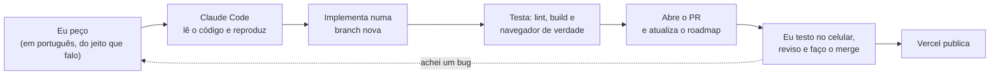

# Pés Descalços FC

**Cartinhas, estatísticas e seleção do fut da galera.**

[pes-descalcos.vercel.app](https://pes-descalcos.vercel.app) · Next.js 16 · Supabase · Vercel

Um site de brincadeira pro nosso grupo de futebol: cada jogador vira uma cartinha no estilo FUT, cada fut fica registrado com placar, gols e assistências, e o site monta sozinho a seleção da rodada, as estatísticas da temporada e até sorteia times equilibrados.

## O que tem

### Seleção do fut

Os melhores de cada fut num campo de fut7 (1 goleiro, 2 zagueiros, 2 meias, 2 atacantes), em cartas pretas no estilo das cartas inform do FIFA. A escolha é pelos números do fut (gols + assistências), e o craque ganha a tarja dourada (o admin pode escolher outro). Passando o mouse numa carta do campo, ela aparece grande do lado.

### No celular

Tudo foi pensado pro celular primeiro, que é onde a galera abre o site: cabeçalho que cabe em 320px, toque longo na carta pra copiar ou baixar como imagem, campos que não dão zoom no iPhone.

### Futs

Cada fut tem placar, resultado e os destaques da partida.

### Estatísticas

Quem mais fez gols, deu assistências, venceu, entrou na seleção do fut e foi craque, com uma frase explicando cada tabela. Dá pra ver do mês, do ano ou desde sempre, e empate divide a colocação.

### Sorteio de times

Marca quem vai jogar e o sorteio divide branco x preto com a soma dos níveis mais parecida possível, dividindo cada posição entre os dois lados. "Sortear de novo" traz outra divisão também equilibrada.

### Área do admin

Só quem tem a senha lança os dados. O admin cadastra jogadores (com foto enquadrada na hora e a cartinha atualizando ao lado), registra os futs e pode trocar na mão qualquer vaga da seleção.

| Cadastro do jogador | Troca de vaga na seleção |
|---|---|
|  |  |

## Identidade visual

A cara do site saiu das camisas do grupo — uma preta e uma branca —, e cada uma virou um tema. Os temas seguem o sistema do aparelho até a pessoa escolher no botão do cabeçalho; a escolha fica no cookie `tema`.

- **Escuro (camisa preta):** fundo preto com rosas vinho e detalhes dourados.
- **Claro (camisa branca):** branco frio com uma estampa de mármore líquido cinza-azulada, o azul do número nos detalhes, menu do cabeçalho em branco e toques de dourado (escudo, frisos, sombra dos botões). A estampa (`public/texturas/marmore.svg`) sai de `scripts/textura-marmore.py`, que desenha a partir de ruído distorcido e vetoriza em curvas — faixas que correm juntas, fazem voltas e afinam em ponta, imitando o tecido.

As cores são tokens em `src/app/globals.css` (`bg-fundo`, `text-tinta`, `text-apagado`, `border-linha`, `bg-destaque`, `text-realce`...), redefinidos por tema, então trocar de tema é só trocar os valores. As fontes puxam o retrô: Alfa Slab One nos títulos (como no escudo), Bebas Neue nos números e rótulos, Barlow no texto e Caveat Brush nos detalhes.

A cartinha (`src/components/jogador-card.tsx`) segue o modelo FUT: moldura de ouro, prata ou bronze pelo nível, foto num medalhão redondo e todas as medidas em `cqw` pra escalar com a largura da carta, do elenco no desktop ao campo no celular. O cabeçalho e o rodapé levam o símbolo da barra da camisa (`src/components/bardo.tsx`), azul com aro branco no claro e dourado no escuro.

## Como foi feito

O projeto saiu em uma semana (de 14 a 21 de setembro de 2026), com quase 30 pull requests e mais de 70 commits, sempre neste ritmo:

**1. O pedido.** Eu escrevo o que quero do jeito que falaria com um amigo, muitas vezes testando no celular: *"no mobile tá cortando o placar"*, *"a seleção devia ser pelos gols e assistências"*, *"sobe o localhost e o IP pro celular"*.

**2. Entender e reproduzir.** Antes de mexer em qualquer coisa, o Claude Code lê o código envolvido e a documentação da versão do Next.js que está instalada (o [`AGENTS.md`](AGENTS.md) pede isso, porque o Next 16 mudou bastante). Bug relatado é reproduzido primeiro: ele abre o site num Chrome headless com a tela do tamanho de um celular, mede os elementos e tira print do antes. Quando um bug não aparecia no teste, ele foi atrás no log do servidor. Foi assim que descobriu que o botão "Admin" continuava aparecendo depois do login só em abas que já estavam abertas antes.

**3. Implementar.** Cada mudança numa branch própria (`feat/`, `fix/`, `docs/`), com commits no padrão [Conventional Commits](https://www.conventionalcommits.org/) e comentários no código explicando o *porquê* das decisões menos óbvias.

**4. Testar de verdade.** Lint, TypeScript e build passando não bastam: ele roda um script de navegador contra o site, tira print do depois e testa os fluxos de admin de ponta a ponta, com um cookie de sessão assinado no próprio teste. Os dados de teste têm um prefixo próprio e são apagados no final.

**5. Abrir o PR.** Ele abre o pull request pelo `gh` com a descrição no [template do projeto](.github/pull_request_template.md) (o que muda, como testar, checklist) e atualiza o [`ROADMAP.md`](ROADMAP.md), com uma regra de honestidade: `[x]` só pro que foi testado, `[~]` pro que está pronto mas ainda não foi testado.

**6. Revisar e aprovar.** Eu testo no celular (o Claude Code sobe o servidor de desenvolvimento e me passa o IP da rede), reviso e faço o merge. O merge é sempre meu, nunca dele. Se encontro algum problema, volto pro passo 1 na mesma branch. O CI roda lint e build em todo PR, e a Vercel publica a cada merge na `main`.

Entre uma conversa e outra, o Claude Code guarda notas sobre como eu gosto de trabalhar (quem abre e quem faz merge dos PRs, como testar, as armadilhas que já apareceram). Assim cada sessão continua de onde a outra parou.

Antes de subir pra Vercel, também pedi uma revisão de segurança: segredos no histórico do git, `requireAdmin()` em toda escrita, RLS no banco, validação do upload, redirecionamento aberto e `npm audit`.

## Como funciona por dentro

### Modelo de dados

Cinco tabelas (o esquema fica em `supabase/migrations/`):

- **jogador** — cadastro (nome, apelido, número, foto, posição, nível escolhido, se está ativo no grupo)
- **fut** — cada partida (data, placar time branco x time preto e, se o admin escolheu, o craque)
- **participacao** — números de um jogador num fut (de que lado jogou, gols, assistências)
- **selecao_escolha** — as vagas da seleção que o admin trocou na mão
- **login_tentativa** — tentativas de login do admin (só um hash do IP), pro bloqueio depois de 5 senhas erradas em 15 min

Não existe tabela de "times": os lados de cada fut são só `branco`/`preto`, escolhidos a cada partida. A seleção do fut é calculada na hora a partir de `participacao`; só as trocas manuais (e o craque escolhido na mão) ficam guardadas.

### Nível das cartinhas

Os critérios ficam em `src/lib/nivel.ts`.

**Nível (70 a 95):** o admin escolhe o nível de cada jogador no cadastro (bronze até 75, prata até 79, ouro a partir de 80), e cada fut jogado depois disso mexe um pouquinho nele. A carta mostra o nível atual e a variação (▲/▼).

Cada fut dá uma nota ao jogador:

- **Gols e assistências** somam pontos
- **Defesa**: metade do saldo do time no fut
- **Peso por posição**: goleiro e zagueiro têm peso alto na defesa; meia e atacante, em gols e assistências

A nota é comparada com a média do grupo dele naquele fut (goleiros + zagueiros, meias + atacantes): acima da média sobe, abaixo desce. Cada fut derruba no máximo 2 pontos e sobe no máximo 2. Subir fica mais difícil quanto mais alto o nível: o ganho máximo cai pela metade a cada 8 níveis. Quando o admin muda o nível na mão, só os futs cadastrados depois disso passam a contar.

### Seleção do fut

Critérios em `src/lib/selecao.ts`. A nota da seleção é **gols + assistências**, sem o saldo do time (senão quem fez 1 gol no time que ganhou de lavada passaria na frente de quem fez 2G/1A no que perdeu). Desempate: mais gols, depois o time que foi melhor no placar (é o que separa goleiros e zagueiros), depois ordem alfabética.

As vagas são preenchidas pelos melhores de cada posição. Se faltar gente numa posição, a vaga vai pro melhor que sobrou e aparece como "improvisado". O craque do fut é o de melhores números entre os escalados (se alguém pontuou). O admin pode trocar: botão direito (ou toque longo no celular) numa carta do campo e "Tornar craque", que vale pra qualquer um da seleção. Se o escolhido sair da seleção, o craque volta pra conta.

### Sorteio de times

Critérios em `src/lib/sorteio.ts`. A força de cada time é a soma dos níveis das cartinhas. O sorteio:

1. Divide cada posição entre os dois lados, intercalando: um goleiro pra cada time, zagueiros divididos, e assim por diante. Quem não tem posição completa os times
2. Troca jogadores da mesma posição entre os times enquanto isso aproximar a força dos dois
3. Repete isso 200 vezes com ordens aleatórias e escolhe ao acaso uma das divisões com diferença de até 2 pontos a mais que a melhor, pra "sortear de novo" trazer times diferentes

Tudo roda no navegador, nada é salvo. O admin pode levar os times sorteados pro registro do fut.

### Fotos das cartinhas

Ficam no bucket público `fotos` do Supabase Storage, em `jogadores/<id>/<timestamp>.jpg`; a URL pública vai na coluna `jogador.foto_url`. Qualquer um lê pela URL, mas só o servidor sobe e apaga, com a `SUPABASE_SERVICE_ROLE_KEY` (`src/data/fotos.ts`).

Ao escolher a foto, abre um enquadramento (arrastar, pinça ou roda do mouse), e o navegador recorta e reduz pra 400×400 JPEG (~30 KB) antes de enviar (`src/lib/foto.ts`), então foto de celular de vários MB passa no limite de 1 MB das Server Actions. Trocar ou remover a foto apaga a anterior do bucket, e excluir o jogador também; jogador arquivado mantém a foto.

### Admin

Tudo é público pra ler. Pra lançar dados, o admin entra com a senha (com o Turnstile configurado, passa antes por um captcha da Cloudflare) e a sessão fica num cookie assinado (HMAC), `httpOnly`, por 30 dias. Toda escrita no banco passa por `requireAdmin()` na camada de dados, então chamar uma Server Action sem o cookie não faz nada.

### Backup e uptime

O plano grátis do Supabase não faz backup e pausa o projeto depois de 7 dias parado. Duas coisas cobrem isso, ambas grátis e automáticas: um cron diário da Vercel (`/api/manter-ativo`) mantém o banco acordado, e um GitHub Action guarda todo dia um backup do banco e das fotos, criptografado com AES-256 (o repositório é público) e mantido por 30 dias.

## Stack

- [Next.js 16](https://nextjs.org) (App Router, Server Actions) + TypeScript + Tailwind CSS v4
- Postgres no [Supabase](https://supabase.com), acessado direto pelo servidor com [`postgres`](https://github.com/porsager/postgres); fotos no Supabase Storage
- Deploy na [Vercel](https://vercel.com), CI no GitHub Actions (lint + build)

## Estrutura

- `src/app/` — rotas e Server Actions
- `src/data/` — acesso a dados (só roda no servidor): queries, fotos, autenticação de admin
- `src/components/` — componentes visuais (cartinha, campo, placar, menu)
- `src/lib/` — regras e helpers compartilhados entre servidor e cliente (nível, seleção, sorteio, ranking, `estilo.ts` com as classes de botão, campo e painel)
- `supabase/migrations/` — o esquema do banco, em ordem
- `scripts/` — backup, dados de teste e o gerador da estampa do tema claro
- `docs/prints/` — os prints deste README
